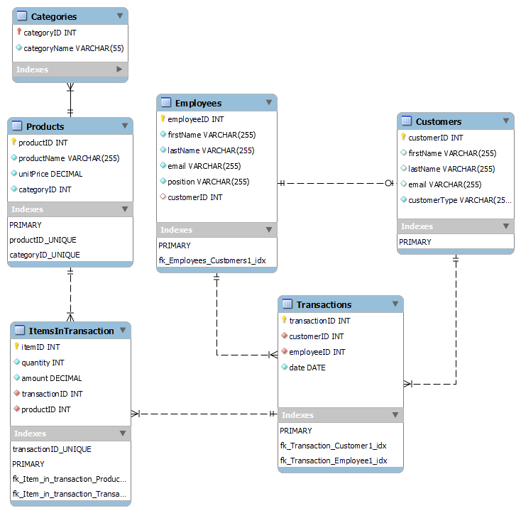
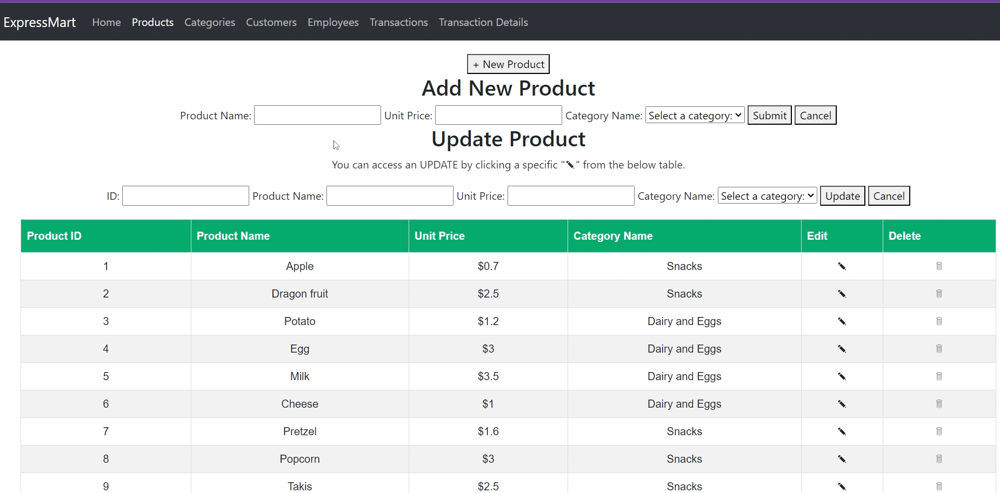
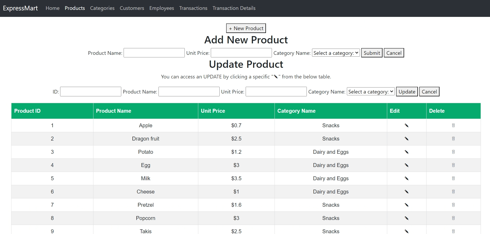

# Database Portfolio Project - Express Mart
Completed by: Su Youn Jeon and Xinrui Hou

## Table of Contents
1. [Overview]
2. [Database Outline]
3. [Schema]
4. [Navigation]
5. [Citation]

## Overview
ExpressMart is a grocery store with an annual revenue of $1.5 million and employing a staff of 50 individuals. In order to operate the business efficiently, they need a website with a robust database backend for the purpose of recording sales orders for products to customers. This system will facilitate the tracking of more than 100,000 sales transactions each year, helping to analyze sales patterns, customer preferences, and identification of potential product additions, ultimately leading to improved customer service and continued growth in their highly competitive market.  

## Database Outline
* **Homepage** - navigates users to other pages to interact with database. 
* **Products** - documents the inventary data for products.
* **Categories** - relational entity to Products, documents products category. 
* **Customers** - stores customers' data including names, emails and customer types. 
* **Employees** - stores employees' data including names, emails and positions.
* **Transactions** - documents ExpressMart's transaction data including customer email, employee email, transaction date and total amount.
* **Transaction Detail** - records details for each transaction including items, quantity and amount.

## Schema

## Nevigation

* **Homepage walkthrough** - visually presents the six functional pages that users can interact with our ExpressMart database. 

* **Products page walkthrough** - users are able to conduct CRUD (create, read, update and delete) operations with this page. All data are altered in Maria Database simultaneously. 

* **Categories page walkthrough** - users are able to conduct CRUD (create, read, update and delete) operations with the categories table. All data are altered in Maria Database simultaneously. 

* **Customers page walkthrough** - users are able to conduct CRUD (create, read, update and delete) operations with the customers table. All data are altered in Maria Database simultaneously. 
